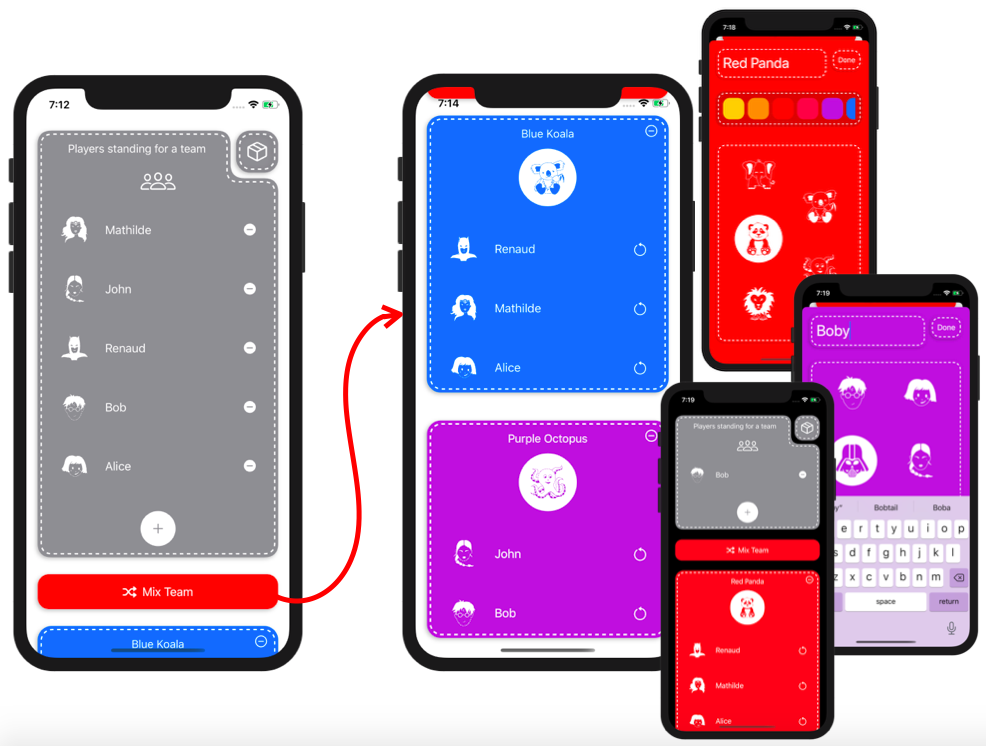

# MixTeam

>MixTeam is an old project started in late 2017 and maintained just for my personal usage until mid 2018.
>I want now to migrate this project to modern Swift 5 and SwiftUI, and also publish it.

⚠️ MixTeam name will certainly change, as I don't know yet if this name is already taken by another app.

MixTeam will help you organise your boardgames or team sport match.

* Add Teams with different logo and colours (Red Koala 🐨, Blue Panda 🐼, etc.)
* Add Players, you can even choose their avatar among some iconic pop culture characters
* Tap on the 🔀 **Mix Team** button, and Players will randomly put into teams
* Simply as that, now just enjoy your game!

## Screenshots

## TODO

* ~~Add Linter rules~~
* ~~Migrate views to SwiftUI~~
* Add Unit Tests with Snapshots for views
* ~~Improve UI~~
* ~~Add GitHub Actions CI~~
* *etc.*
